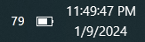
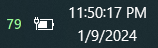

# percentage

This is a [fork of a project done by Kenneth Schnall](https://github.com/kas/percentage) that displays battery percentage in the Windows 10 system tray, with some minor tweaks that are optimized for my laptop and preferences.

The biggest change I made was making the text a different color when the computer is charging. The original code adds a degree sign but it makes the text blurry for me.

## Installing

1. [Download the latest release](https://github.com/noahpark101/percentage/releases)
1. Put percentage.exe in your startup folder
   1. To get to your startup folder, press Windows+R, type "shell:startup", then press enter

## Compiling

This project was compiled with Visual Studio Community 2022.

Select ".NET desktop development" when setting up Visual Studio.

To build the project
1. Open the percentage/percentage.sln file with Visual Studio
1. Click "Build > Build Solution"
1. percentage.exe can be found at percentage\percentage\percentage\bin\Debug\percentage.exe
